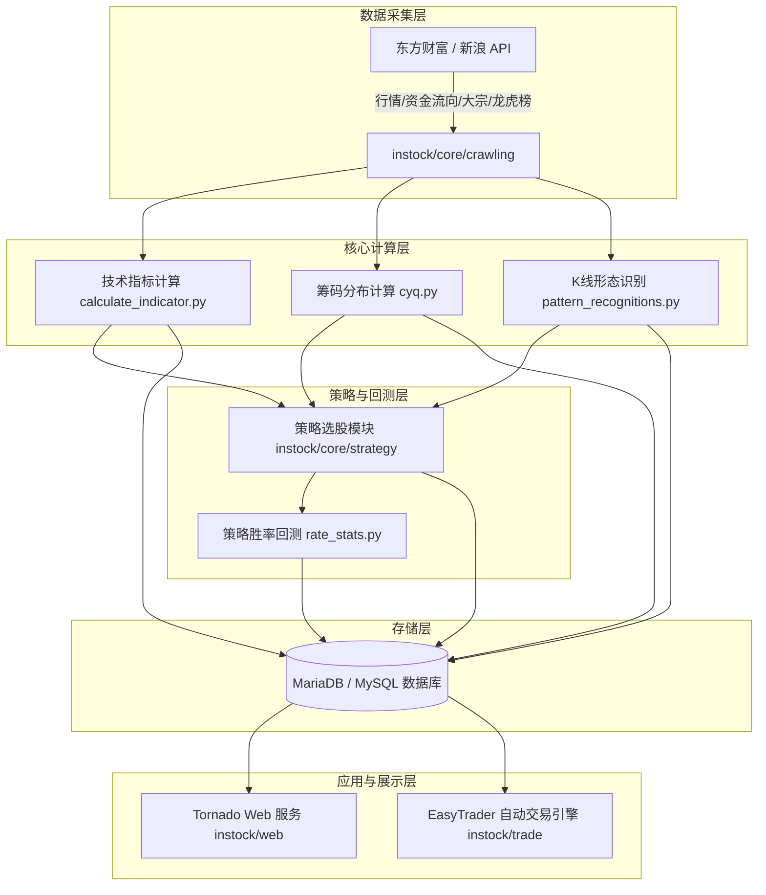

# InStock 股票量化选股与交易系统 - 项目分析与调试指南

> 本文档包含了对 **InStock** 项目的代码结构、核心功能模块、技术栈、算法逻辑、数据流架构、部署调度机制以及本地 VS Code Debug 调试指南的完整总结。

---

## 一、 项目概述

**InStock** 是一套开源的 **A 股 / ETF 量化分析、因子计算、策略选股、回测验证与自动交易系统**。系统通过抓取每日股票和 ETF 的关键行情及资金流向数据，基于 `TA-Lib` 和 `Pandas` 高效计算 30+ 项技术指标与筹码分布 (CYQ)，并精确识别 61 种 K 线形态。此外，系统内置了 11 种量化选股策略及策略胜率回测验证机制，支持基于 EasyTrader 的自动下单交易，并提供了响应式的 Web 可视化控制台与 Docker 容器化部署方案。

---

## 二、 架构与数据流

下图展示了系统从数据采集、处理计算、策略筛选、回测验证到展示与交易的完整数据流向：



---

## 三、 完整目录结构全景

```
stock/
├── .agents/
│   └── AGENTS.md                  # Agent 自动载入的项目上下文与规范指南
├── .github/                       # GitHub Actions 自动化工作流配置
├── .vscode/                       # VS Code 调试配置文件 (launch.json)
├── cron/                          # Cron 定时任务配置 (hourly, monthly, workdayly)
├── docker/                        # Docker 容器化配置 (Dockerfile, docker-compose.yml, build.sh)
├── img/                           # 项目架构图与系统界面截图
├── instock/                       # 核心业务 Python 源码目录
│   ├── bin/                       # 系统运维与启动脚本 (.sh, .bat)
│   ├── config/                    # 配置文件 (trade_client.json, proxy.txt, cookie)
│   ├── core/                      # 核心算法与数据计算层
│   │   ├── backtest/              # 策略胜率回测模块 (rate_stats.py)
│   │   ├── crawling/              # 行情/资金流/大宗交易/龙虎榜数据爬虫
│   │   ├── indicator/             # 基于 TA-Lib 的 30+ 项技术指标计算库
│   │   ├── kline/                 # K线与筹码分布算法 (cyq.py 筹码分布)
│   │   ├── pattern/               # 61 种 K线形态匹配与评分识别
│   │   ├── strategy/              # 11 种量化选股策略集 (突破/多头/平台/海龟等)
│   │   ├── eastmoney_fetcher.py   # 东方财富 API 数据抓取器
│   │   ├── singleton_*.py         # 数据单例缓存 (股票列表/代理/交易日历)
│   │   ├── stockfetch.py          # 统一数据抓取入口
│   │   └── tablestructure.py      # MySQL 数据库表结构全集定义 (9000+行)
│   ├── job/                       # 盘后每日计算 Job 作业集
│   │   ├── execute_daily_job.py   # 每日 Job 调度入口主程序
│   │   ├── daily_fetch_pipeline.py# 独立抓取项执行与验证管线 (含基本面选股与资金流)
│   │   ├── init_job.py            # 数据库初始化与建表作业
│   │   ├── basic_data_*.py        # 基础行情与行情扩展 Job (包含 basic_data_other_daily_job)
│   │   ├── indicators_data_daily_job.py  # 技术指标计算 Job
│   │   ├── klinepattern_data_daily_job.py # K线形态匹配 Job
│   │   ├── selection_data_daily_job.py  # 综合选股 Job
│   │   ├── strategy_data_daily_job.py   # 选股策略计算 Job
│   │   └── backtest_data_daily_job.py   # 胜率回测 Job
│   ├── lib/                       # 通用底层工具库
│   │   ├── database.py            # DB 数据库连接池与 SQL 辅助类
│   │   ├── torndb.py              # Tornado 轻量级 MySQL ORM 封装
│   │   ├── trade_time.py          # A股交易日与交易时间判断工具
│   │   └── crypto_aes.py          # AES 数据加密工具
│   ├── trade/                     # 自动化交易系统 (EasyTrader 驱动)
│   │   ├── robot/                 # 实盘交易机器人
│   │   ├── strategies/            # 实盘交易策略
│   │   └── trade_service.py       # 自动化交易与自动打新服务入口
│   └── web/                       # Tornado Web 可视化控制台
│       ├── static/                # 静态资源 (JS, CSS, DataTables, Echarts/Bokeh)
│       ├── templates/             # HTML 模版
│       └── web_service.py         # Tornado Web 服务器主程序
├── supervisor/                    # Supervisor 进程守候与监控配置
├── LICENSE                        # Apache 2.0 开源许可协议
├── NOTE.md                        # Docker 数据库快速启动笔记
├── PROJECT_ANALYSIS.md            # 项目完整分析与调试指南 (本文档)
├── README.md                      # 项目说明文档
└── requirements.txt               # Python 依赖包清单
```

---

## 四、 核心代码模块拆解

项目的核心代码存放在 `instock/` 目录下，主要分为 7 大核心模块：

### 1. 数据抓取与解析 (`instock/core/crawling/`)
封装了针对东方财富 (Eastmoney)、新浪财经 (Sina) 等数据源的爬虫抓取方法：
- 数据抓取入口 (`instock/core/stockfetch.py`): 统一封装数据抓取逻辑。
- 交易日历历史 (`instock/core/crawling/trade_date_hist.py`): 智能识别与同步 A 股历史交易日历。
- 行情与特色数据：包括股票与行业/概念资金流向、大宗交易、龙虎榜、分红配送、早尾盘抢筹及涨停原因揭秘。

### 2. 技术指标与筹码分布 (`instock/core/indicator/` & `instock/core/kline/`)
- 技术指标计算器 (`instock/core/indicator/calculate_indicator.py`): 基于 `TA-Lib` 计算 MACD, KDJ, BOLL, RSI, CCI, ATR, Supertrend, StochRSI, ENE, VWMA 等 30 余种指标，公式经调优确保与同花顺、通达信保持一致。
- 筹码分布算法 (CYQ) (`instock/core/kline/cyq.py`): 通过计算历史交易日内的最高价、最低价与成交量分布，高精度拟合出筹码成本分布。

### 3. K 线形态识别 (`instock/core/pattern/`)
- 形态识别模块 (`instock/core/pattern/pattern_recognitions.py`): 集成 TA-Lib 蜡烛图识别能力，可精准判定 61 种 K 线形态（如早晨之星、黄昏之星、三只乌鸦、红三兵、锤头线、穿头破脚等），并给出正负买卖信号评分。

### 4. 选股策略集 (`instock/core/strategy/`)
内置 11 种量化选股模型：
| 策略名称 | 脚本文件 | 核心逻辑摘要 |
| :--- | :--- | :--- |
| **放量上涨** | `enter.py` | 成交额 $\ge 2$ 亿，成交量是 5 日均量的 2 倍以上，且当日上涨 |
| **均线多头** | `keep_increasing.py` | MA30 持续向上展开多头排列 |
| **停机坪** | `parking_apron.py` | 前期大阳放量拉升，随后在上方小幅小阴小阳高位横盘整理 |
| **回踩年线** | `backtrace_ma250.py` | 前期突破 250 日年线，随后缩量回踩年线获得支撑 |
| **突破平台** | `breakthrough_platform.py` | 长时间区间窄幅整理后放量突破 60 日均线或近 60 日高点平台 |
| **无大幅回撤**| `low_backtrace_increase.py` | 60 日累计涨幅 $\ge 60\%$ 且近 60 日无单日跌幅超 7% 或两日累计跌超 10% |
| **海龟交易** | `turtle_trade.py` | 收盘价创最近 60 日新高 |
| **高而窄旗形**| `high_tight_flag.py` | 短期内暴涨 90% 以上，随后形成紧凑的旗形整理 |
| **放量跌停** | `climax_limitdown.py` | 跌幅 $> 9.5\%$，成交额 $\ge 2$ 亿且为 5 日均量的 4 倍以上 |
| **低 ATR 成长**| `low_atr.py` | 上市满 250 日，真实波幅指标处于低位，盘整蓄势 |

### 5. 策略回测 (`instock/core/backtest/`)
- 回测统计 (`instock/core/backtest/rate_stats.py`): 追踪策略选出股票在后续 1, 3, 5, 10, 20 个交易日的涨跌幅分布与胜率。

### 6. Web 控制台 (`instock/web/`)
- Web 入口服务 (`instock/web/web_service.py`): 基于 Tornado 提供 REST API 与页面渲染。支持 200+ 维度的条件自由组合选股、数据表格交互以及股票关注/收藏标记。

### 7. 自动化交易系统 (`instock/trade/`)
- 交易服务入口 (`instock/trade/trade_service.py`): 基于 `easytrader` 整合广发证券等券商客户端，实现自动化交易策略挂载、事件监听及自动打新股。

> [!WARNING]
> 自动交易涉及真实资金风险。默认交易脚本包含交易日 10:00 自动打新股逻辑，需谨慎配置 `trade_client.json`。

---

## 五、 技术栈总结

| 领域 | 选型 | 作用与说明 |
| :--- | :--- | :--- |
| **编程语言** | Python 3 | 核心开发语言 |
| **数据处理** | `pandas`, `numpy`, `TA-Lib`, `arrow` | 矩阵计算、指标计算及时间序列处理 |
| **Web 框架** | `tornado` | 高并发异步 Web 服务器 |
| **数据库/ORM**| MariaDB / MySQL, `SQLAlchemy`, `PyMySQL`, `torndb` | 数据持久化与 SQL 映射 |
| **自动交易** | `easytrader`, `pycryptodome` | 券商客户端自动化控制与数据加密 |
| **前端可视化**| DataTables, Bokeh, Custom JS (CYQ) | 交互式数据表格与筹码/K线图表 |
| **运维部署** | Docker, Docker-Compose, Cron, Supervisor | 容器化隔离与定时调度运维 |

---

## 六、 本地 VS Code Debug 调试指南

### 1. 说明（关于数据库选型）
> [!IMPORTANT]
> 原生项目绑定了 MySQL/MariaDB 语法（`pymysql` 驱动），不支持直接改为 PostgreSQL。
> 推荐通过 Docker 启动轻量 MariaDB 容器（无需本地手动安装配置 MySQL 软件），Python 本地代码连接 Docker 数据库进行单步调试。

### 2. 启动数据库容器
在 Terminal 中运行：
```bash
docker run -d \
  --name instockdb \
  -p 3306:3306 \
  -e MYSQL_ROOT_PASSWORD=root \
  mariadb:latest
```

### 3. 配置本地虚拟环境与依赖
```bash
brew install ta-lib
python3 -m venv venv
source venv/bin/activate
pip install -r requirements.txt
```

### 4. VS Code 调试配置文件 (`.vscode/launch.json`)
创建或编辑 `.vscode/launch.json` 文件：
```json
{
    "version": "0.2.0",
    "configurations": [
        {
            "name": "Debug Web Service (Web控制台)",
            "type": "debugpy",
            "request": "launch",
            "program": "${workspaceFolder}/instock/web/web_service.py",
            "console": "integratedTerminal",
            "env": {
                "PYTHONPATH": "${workspaceFolder}",
                "db_host": "localhost",
                "db_port": "3306",
                "db_user": "root",
                "db_password": "root",
                "db_database": "instockdb"
            }
        },
        {
            "name": "Debug Daily Job (每日计算与选股作业)",
            "type": "debugpy",
            "request": "launch",
            "program": "${workspaceFolder}/instock/job/execute_daily_job.py",
            "console": "integratedTerminal",
            "args": [],
            "env": {
                "PYTHONPATH": "${workspaceFolder}",
                "db_host": "localhost",
                "db_port": "3306",
                "db_user": "root",
                "db_password": "root",
                "db_database": "instockdb"
            }
        },
        {
            "name": "Debug Init Database (初始化数据库)",
            "type": "debugpy",
            "request": "launch",
            "program": "${workspaceFolder}/instock/job/init_job.py",
            "console": "integratedTerminal",
            "env": {
                "PYTHONPATH": "${workspaceFolder}",
                "db_host": "localhost",
                "db_port": "3306",
                "db_user": "root",
                "db_password": "root",
                "db_database": "instockdb"
            }
        }
    ]
}
```

### 5. 调试步骤
1. 打开 VS Code 调试面板 (`Cmd + Shift + D`)。
2. 选择 **Debug Init Database** 启动运行，完成 `instockdb` 建库与基础表创建。
3. 选择 **Debug Daily Job** 并在选股策略或指标计算脚本中打断点，按 `F5` 调试盘后计算逻辑。
4. 选择 **Debug Web Service** 启动 Web 服务，浏览器访问 `http://localhost:9988/` 调试页面接口与交互逻辑。

---

## 七、 生产环境运行与部署

### 1. 命令行直接执行
```bash
# 执行当前交易日任务
python instock/job/execute_daily_job.py

# 启动 Web 服务
python instock/web/web_service.py
```

### 2. Docker Compose 一键启动
```bash
cd docker
docker-compose up -d
```
